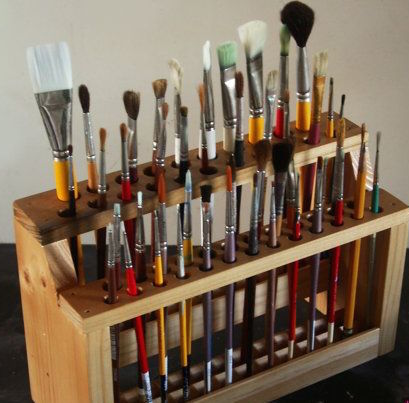

1.	My programming skills have greatly improved in the following ways:
I couldn’t agree more with this statement. Before I took this class, I had no prior knowledge on what coding was and how to even start. The entry level class everyone took (ICS), wasn’t even offered at my old school so this was all new to me. I feel I have come a long way from where I was. I know how to, one, create a functioning website to display information. Two, dynamically populate a website by getting information from different files, whether it be a JavaScript or JSON file. Three, styling a website to better organize the page and just make it look a lot nicer. There are so many areas where I thought I have improved in, but overall, I think my I am a lot further than where I was.  
2.	I need to work on the following to improve my programming skills:
I think the biggest thing I need to work on is what functions go with what, and to continue to better understand what code does what. I noticed in assignment 1 I struggled with knowing what code to use and where. One other thing I think I still need to improve in, is troubleshooting. I think in a lot of situations, when coding, there is some type of troubleshooting going on. Knowing what you are doing wrong and how to fix it is important when programming. 
3.	I have learned a lot from doing WODs and I can do them without copying the screencast:
Some WODs/POKEs I can do without following the screencasts, but there are others where I can’t. It’s like I have some type of idea of what to do and the direction I need to be in, but I don’t know for sure. A good amount of the WODs/POKEs were difficult without following the screencast. But I have learned a lot from doing them, copying the screencast or not. 
4.	The labs have help me learn and I am able to complete them with confidence:
The labs have definitely helped me learn. However, I don’t think I have ever done one whole one on my own. I have always had to watch the walkthrough video to complete the lab. I could always do maybe a few or some of the questions/parts, but I would eventually get stuck and not know what to do. But once I saw how to do it, I understood, in most cases. Of course, there were sometimes where I still was left a little confused, but I got the general idea. 
5.	I learned a lot from my experience doing Assignment 1 and feel ready to work on Assignment 2:
Yes, I learned a lot from my experience with Assignment 1, and am now ready to start Assignment 2. I will do my best at least lol. Programming definitely does not come easy to me, and this is easily one of the hardest classes I have ever took. 
6.	I think the class can be improved to help my learning in the following ways:
The class is perfect how it is. Couldn’t have asked for a better Professor, TA, or class. 
7.	What helps me the most in class are (WODs, Labs, class website, screencasts, readings, quizzes, one on one help, working with classmates, etc.):
I would say the labs helped me the most, but it was only possible because of the instructor.
